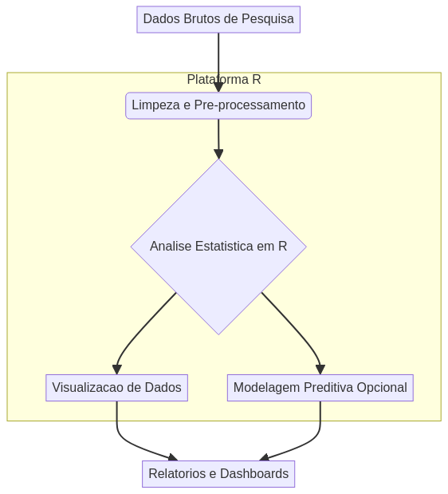
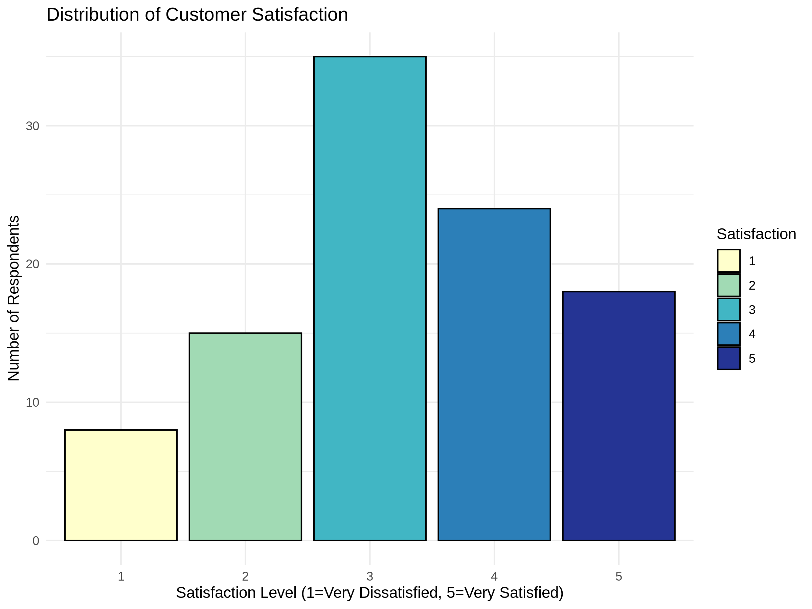

# R-Survey-Analytics

## Professional R-Survey-Analytics - Created by Gabriel Demetrios Lafis


## Badges

[](https://www.r-project.org/)
[](https://github.com/galafis/R-Survey-Analytics/commits/master)
[](https://github.com/galafis/R-Survey-Analytics)
[](https://github.com/galafis/R-Survey-Analytics/blob/master/LICENSE)
[](https://ggplot2.tidyverse.org/)
[](https://dplyr.tidyverse.org/)

## Descrição

Este repositório apresenta uma plataforma profissional para análise de dados de pesquisa utilizando a linguagem R. Desenvolvido por Gabriel Demetrios Lafis, o projeto foca em fornecer ferramentas robustas e eficientes para processamento, análise estatística e visualização de dados de surveys, garantindo resultados precisos e insights acionáveis. A estrutura do projeto é modular e escalável, ideal para cientistas de dados e pesquisadores que buscam uma solução completa e de alta qualidade para suas análises.

## Description

This repository presents a professional platform for survey data analysis using the R language. Developed by Gabriel Demetrios Lafis, the project focuses on providing robust and efficient tools for processing, statistical analysis, and visualization of survey data, ensuring accurate results and actionable insights. The project structure is modular and scalable, ideal for data scientists and researchers seeking a complete and high-quality solution for their analyses.

## Funcionalidades

*   **Processamento de Dados:** Ferramentas para limpeza, transformação e preparação de dados de pesquisa.
*   **Análise Estatística:** Implementação de métodos estatísticos avançados para análise de surveys.
*   **Visualização de Dados:** Geração de gráficos e relatórios interativos para comunicação de resultados.
*   **Estrutura Modular:** Organização clara e escalável do código para fácil manutenção e expansão.
*   **Documentação Completa:** Instruções detalhadas para instalação, uso e contribuição.

## Features

*   **Data Processing:** Tools for cleaning, transforming, and preparing survey data.
*   **Statistical Analysis:** Implementation of advanced statistical methods for survey analysis.
*   **Data Visualization:** Generation of interactive charts and reports for communicating results.
*   **Modular Structure:** Clear and scalable code organization for easy maintenance and expansion.
*   **Comprehensive Documentation:** Detailed instructions for installation, usage, and contribution.

## Arquitetura



## Como Usar

### Pré-requisitos

Certifique-se de ter o R e o RStudio (opcional, mas recomendado) instalados em seu sistema.

### Instalação

1.  Clone o repositório:
    ```bash
    git clone https://github.com/galafis/R-Survey-Analytics.git
    cd R-Survey-Analytics
    ```
2.  Instale as dependências do R (se houver):
    ```R
    # Exemplo: install.packages("survey")
    # Adicione aqui as dependências específicas do projeto
    ```

### Execução

Para executar a análise principal, utilize o script `src/main.R`:

```bash
Rscript src/main.R
```

## How to Use

### Prerequisites

Ensure you have R and RStudio (optional, but recommended) installed on your system.

### Installation

1.  Clone the repository:
    ```bash
    git clone https://github.com/galafis/R-Survey-Analytics.git
    cd R-Survey-Analytics
    ```
2.  Install R dependencies (if any):
    ```R
    # Example: install.packages("survey")
    # Add specific project dependencies here
    ```

### Execution

To run the main analysis, use the `src/main.R` script:

```bash
Rscript src/main.R
```

## Exemplos de Uso

### Exemplo 1: Análise Descritiva

```R
# Carregar o script principal
source("src/main.R")

# Executar a função principal
main()
```

Este exemplo executa a análise padrão definida no `main.R`, que inclui a geração de um gráfico simples. Para análises mais complexas, você pode modificar o `main.R` ou criar novos scripts em `src/`.

### Example 1: Descriptive Analysis

```R
# Load the main script
source("src/main.R")

# Run the main function
main()
```

This example runs the standard analysis defined in `main.R`, which includes generating a simple plot. For more complex analyses, you can modify `main.R` or create new scripts in `src/`.

### Exemplo 2: Visualização da Distribuição de Satisfação

Após executar o script `src/main.R`, um gráfico da distribuição de satisfação será gerado e salvo em `assets/satisfaction_distribution.png`.



### Example 2: Satisfaction Distribution Visualization

After running the `src/main.R` script, a satisfaction distribution plot will be generated and saved to `assets/satisfaction_distribution.png`.


## Testes

Para garantir a qualidade e funcionalidade do código, foram implementados testes unitários. Para executá-los, siga os passos abaixo:

### Pré-requisitos

Certifique-se de ter o pacote `testthat` instalado no R:

```R
install.packages("testthat")
```

### Execução dos Testes

1.  Navegue até a pasta `tests` no terminal:
    ```bash
    cd tests
    ```
2.  Execute os testes:
    ```R
    library(testthat)
    test_file("test_main.R")
    ```

## Tests

To ensure code quality and functionality, unit tests have been implemented. To run them, follow the steps below:

### Prerequisites

Make sure you have the `testthat` package installed in R:

```R
install.packages("testthat")
```

### Running Tests

1.  Navigate to the `tests` folder in your terminal:
    ```bash
    cd tests
    ```
2.  Run the tests:
    ```R
    library(testthat)
    test_file("test_main.R")
    ```

## Contribuição

Contribuições são bem-vindas! Por favor, siga as diretrizes de contribuição do projeto.

## Contributing

Contributions are welcome! Please follow the project's contribution guidelines.

## Licença

Este projeto está licenciado sob a Licença MIT. Veja o arquivo [LICENSE](LICENSE) para mais detalhes.

## License

This project is licensed under the MIT License. See the [LICENSE](LICENSE) file for more details.

## Autor

Gabriel Demetrios Lafis

## Author

Gabriel Demetrios Lafis
